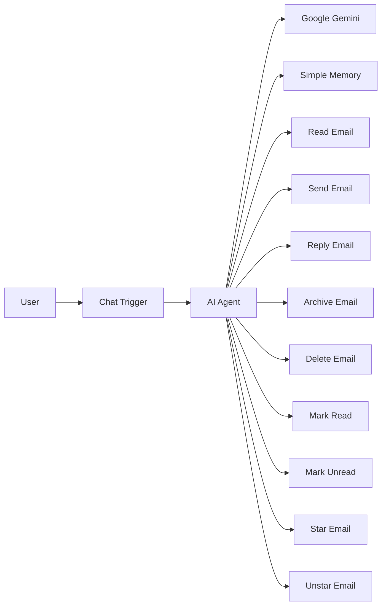

# 📧 AI Gmail Assistant


An AI-powered Gmail Assistant built with **n8n**, **Google Gemini**, and the **Gmail API**.

The assistant understands natural language and automatically chooses the correct Gmail operation based on the user's request.

---

# 🚀 Project Overview

This project demonstrates how Large Language Models can control Gmail through workflow automation.

Instead of manually selecting different operations, users simply type natural language prompts such as:

- Read my latest email
- Reply politely to John's email
- Archive the latest message
- Send an email to Alice

The AI Agent determines which Gmail tool to execute and returns the response.

---

# ✨ Features

- 📩 Read latest email
- 📬 Read unread emails
- 📤 Send emails
- 💬 Reply to emails
- 🗂 Archive emails
- 🗑 Delete emails
- ⭐ Star emails
- ✩ Unstar emails
- ✅ Mark emails as read
- 📭 Mark emails as unread
- 🤖 Natural language interaction
- 🧠 AI-powered tool selection
- 💾 Conversation memory

---

# 🖼 Workflow

.png)

---

# 🏗 Architecture



---

# ⚙️ Tech Stack

| Technology | Purpose |
|------------|---------|
| n8n | Workflow automation |
| Google Gemini | LLM reasoning |
| Gmail API | Gmail operations |
| AI Agent | Tool selection |
| Simple Memory | Conversation history |

---

# 📂 Project Structure

```
AI-Gmail-Assistant/
│
├── workflow/
│   └── gmail-ai-assistant.json
│
├── README.md
├── LICENSE
```

---

# 🚀 Installation

## 1. Clone Repository

```bash
git clone https://github.com/<your-username>/AI-Gmail-Assistant.git
```

---

## 2. Open n8n

Import the workflow JSON from the **workflow/** folder.

---

## 3. Configure Credentials

Configure:

- Gmail OAuth2
- Google Gemini API

---

## 4. Activate Workflow

Save and activate the workflow.

---

# 🔑 Prerequisites

Before running the workflow you need:

- n8n (Cloud or Self-hosted)
- Google Account
- Gmail API enabled
- OAuth2 Credentials
- Google Gemini API Key

---

# ⚙️ Configuration

Inside n8n configure:

| Credential | Purpose |
|------------|---------|
| Gmail OAuth2 | Access Gmail |
| Google Gemini API | AI reasoning |

Make sure Gmail API is enabled inside your Google Cloud Project.

---

# 💬 Supported Commands

| Command | Action |
|----------|--------|
| Read my latest email | Reads newest email |
| Show unread emails | Lists unread emails |
| Send an email | Sends email |
| Reply to latest email | Replies |
| Archive latest email | Archives |
| Delete latest email | Deletes |
| Star latest email | Stars |
| Unstar latest email | Removes star |
| Mark latest email as read | Marks read |
| Mark latest email as unread | Marks unread |

---

# 💡 Example Prompts

```
Read my latest email

Show unread emails

Reply politely to the latest email

Archive this conversation

Delete the last email

Send an email to john@example.com

Star the latest email

Mark the latest email as read
```

---

# 🔒 Security Notes

- OAuth credentials are never stored in this repository.
- Configure your own Gmail OAuth credentials before using the workflow.
- Never commit API keys or OAuth secrets to GitHub.

---

# 🛣 Roadmap

- Outlook support
- Email summarization
- Calendar integration
- Attachment handling
- Voice commands
- Multi-language support
- Email search
- Draft generation
- Label management

---

# 🤝 Contributing

Contributions are welcome!

1. Fork the repository
2. Create a feature branch
3. Commit your changes
4. Push the branch
5. Open a Pull Request

---

# 👨‍💻 Author

**Kunal Pareek**

If you found this project useful, consider giving it a ⭐ on GitHub.

---

# 📄 License

This project is licensed under the MIT License.
